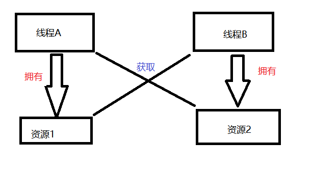
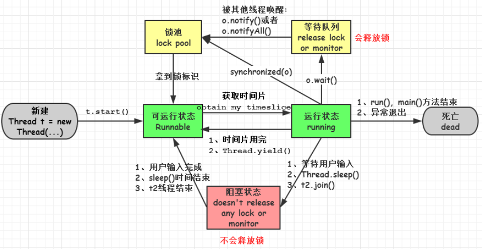

## 1、进程与线程的区别？

> **进程**：是实现某个独立功能的程序，它是操作系统（如windows 系统）进行**资源分配和调度**的一个独立单位，也是可以独立运行的一段程序。
>
> **线程**：是操作系统能够进行**运算调度的最小单位**，它被包含在进程之中，是进程中的实际运作单位，可以使⽤用多线程对进⾏行行运算提速。⽐如，如果⼀个线程完成⼀个任务要100毫秒，那么⽤⼗个线程完成改任务只需10毫秒

**线程与进程之间的区别**：

1. 进程间相互独立，但同一进程内的各个线程会共享该进程拥有的资源，而进程则是用独占的方式来占有资源，进程间不能共享资源。
2. 线程上下文切换（从一个线程切换到另一个线程）的速度要比进程上下文切换速度快的多。
3. 每一个线程都有一个运行的入口、顺序执行序列和出口，但线程不能独立运行，必须依靠进程的调度和控制线程的执行。
4. 一般操作系统级别的会注重“进程”的角度和管理，而应用项目会偏重于“线程”。在编程中偏重于多线程，而不是多进程。

## 2、什么是线程安全与线程不安全？

> **线程安全**：多线程访问时，采用了加锁机制，当一个线程访问该类的某一个数据时，会对该数据进行保护，其他线程无法访问，直到该线程读取完，其他线程才可使用，不会出现数据不一致或数据污染。
>
> **线程不安全**：不提供数据访问保护，有可能出现先后更改数据造成所得到的数据是脏数据

线程安全都是由全局变量和静态变量引起的。

若每个线程中对全局变量、静态变量只有读操作，⽽无写操作，⼀般来说，这个全局变量是线程安全的；

若有多个线程同时执行写操作，一般都需要考虑线程同步，否则的话就可能影响线程安全。

## 3、什么是多线程？多线程的优点与缺点？

> **多线程**：多线程是指程序中包含多个执行流，即在一个程序中可以同时运行多个不同的线程来执行不同的任务。

**优点**：可以提高 CPU 的利用率。在多线程程序中，一个线程必须等待的时候，CPU 可以运行其它的线程而不是等待，这样就大大提高了程序的效率。也就是说允许单个程序创建多个并行执行的线程来完成各自的任务。

**缺点**：

- 线程也是程序，所以线程需要占用内存，线程越多占用内存也越多；
- 多线程需要协调和管理，所以需要 CPU 时间跟踪线程；
- 线程之间对共享资源的访问会相互影响，必须解决竞用共享资源的问题。

## 4、什么是上下文切换？

> - 多线程编程中一般线程的个数都大于 CPU 核心的个数，而一个 CPU 核心在任意时刻只能被一个线程使用，为了让这些线程都能得到有效执行，CPU 采取的策略是为每个线程分配时间片并轮转的形式。当一个线程的时间片用完的时候就会重新处于就绪状态让给其他线程使用，这个过程就属于一次上下文切换。
> - **概括来说就是**：当前任务在执行完 CPU 时间片切换到另一个任务之前会先保存自己的状态，以便下次再切换回这个任务时，可以再加载这个任务的状态。任务从保存到再加载的过程就是一次上下文切换。
> - 上下文切换通常是计算密集型的。也就是说，它需要相当可观的处理器时间，在每秒几十上百次的切换中，每次切换都需要纳秒量级的时间。所以，上下文切换对系统来说意味着消耗大量的 CPU时间，事实上，可能是操作系统中时间消耗最大的操作。
> - Linux 相比与其他操作系统（包括其他类 Unix 系统）有很多的优点，其中有一项就是，其上下文切换和模式切换的时间消耗非常少。

## 5、守护线程与用户线程有什么区别？

> - **守护线程**：运行在后台，为其他前台线程服务。也可以说守护线程是 JVM 中非守护线程的 “佣人”。一旦所有用户线程都结束运行，守护线程会随 JVM 一起结束工作。
> - **用户线程**：运行在前台，执行具体的任务，如程序的主线程、连接网络的子线程等都是用户线程。

## 6、什么是线程死锁？

> **死锁**：指两个或两个以上的线程（进程），在执行过程中，由于竞争资源或由于彼此通信而造成的一种阻塞现象，若无外力作用，它们都将无法推进下去。此时称系统处于死锁状态或系统产生了死锁，这些永远在互相等待的进程（线程）称为死锁进程（线程）。
>
> - 多个线程同时被阻塞，它们中的一个或者全部都在等待某个资源被释放。由于线程被无限期地阻塞，因此程序不可能正常终止。

例如：线程A与线程B都拥有各自的资源，但试图去获取对方的资源，这两个线程就会互相等待而进入死锁状态。



## 7、形成死锁的四个必要条件是什么？

> 1. **互斥条件**：在一段时间内，某个资源只由一个进程占用。如果此时其他进程请求资源，就只能等待，直到占有资源的进程释放。
> 2. **占有且等待条件**：进程至少保持一个资源，但又提出了新的资源的请求，而请求的资源被其他进程占有，此时请求进程阻塞，对自己已经获取的资源保持不放。
> 3. **不可抢占条件**：别人已经占有了某项资源，你不能因为自己也需要该资源，就去把别人的资源抢过来。
> 4. **循环等待条件**：若干进程之间形成一种头尾相接的循环等待资源关系。（比如一个进程集合，A在等B，B在等C，C在等A）

## 8、如何避免死锁？

> 1. 避免一个线程同时获得多个锁
> 2. 避免一个线程在锁内同时占有多个资源，尽量保证每个锁只占有一个资源
> 3. 尝试使用定时锁，使用`lock.tryLock(timeout)`来替代使用内部锁机制

## 9、创建线程的四种方式？

> 1. **继承Thread类**
> 2. **实现 Runnable 接口**
> 3. **使用 Callable 和 Future 创建线程**
> 4. **使用线程池创建线程**

### 1、继承Thread类

**步骤**：

1. 定义Thread类的子类，并重写该类的run()方法，该方法的方法体就是线程需要完成的任务，run()方法也称为线程执行体；
2. 创建Thread子类的实例，也就是创建了线程对象；
3. 启动线程，调用线程的start()方法。

```java
public class CreateThread extends Thread{
    @Override
    public void run() {
        //获取线程名
        System.out.println(Thread.currentThread().getName());
    }

    public static void main(String[] args) {
        CreateThread createThread = new CreateThread();
        //线程启动
        createThread.start();
    }
}
```


### 2、实现Runnable接口

**步骤**：

1. 定义Runnable接口的实现类，一样要重写run()方法，这个run()方法和Thread中的run()方法一样是线程的执行体；
2. 创建Runnable实现类的实例，并用这个实例作为Thread的target来创建Thread对象，这个Thread对象才是真正的线程对象；
3. 调用线程对象的start()方法来启动线程。

```java
public class RunnableCreateThread implements Runnable{
    @Override
    public void run() {
        System.out.println("实现Runnable接口创建线程");
    }

    public static void main(String[] args) {
        new Thread(new RunnableCreateThread()).start();
    }
}
```


### 3、使用Callable和Future创建线程

> 与 Runnable 接口不一样，Callable 接口提供了一个 call() 方法作为线程执行体，call() 方法比 run() 方法功能要强大，比如：call() 方法可以有返回值、call() 方法可以声明抛出异常。
>
> Java5 提供了 Future 接口来代表 Callable 接口里 call() 方法的返回值，并且为 Future 接口提供了一个实现类 FutureTask，这个实现类既实现了 Future 接口，还实现了 Runnable 接口，因此可以作为 Thread 类的 target。在 Future 接口里定义了几个公共方法来控制它关联的 Callable 任务。

**步骤**：

1. 创建实现 Callable 接口的类 MyCallable；
2. 以 myCallable 为参数创建 FutureTask 对象；
3. 将 FutureTask 作为参数创建 Thread 对象；
4. 调用线程对象的 start() 方法

```java
public class MyCallable implements Callable {
    @Override
    public Object call() throws Exception {
        System.out.println(Thread.currentThread().getName());
        return "huahua";
    }

    public static void main(String[] args) {
        //创建 FutureTask 对象
        FutureTask futureTask = new FutureTask<>(new MyCallable());
        //创建线程并启动
        Thread thread = new Thread(futureTask);
        thread.start();
        try {
            Thread.sleep(1000);
            //获取返回值
            System.out.println("返回的结果是：" + futureTask.get());
        } catch (Exception e) {
            e.printStackTrace();
        }
    }
}
```

### 4、基于线程池创建线程

> Executors 提供了一系列工厂方法用于创先线程池，返回的线程池都实现了ExecutorService 接口。
>
> 主要有四种：
>
> 1. newFixedThreadPool：创建一个定长线程池，可控制线程最大并发数，超出的线程会在队列中等待。
> 2. newCachedThreadPool：创建一个可缓存线程池，如果线程池长度超过处理需要，可灵活回收空闲线程，若无可回收，则新建线程。
> 3. newSingleThreadExecutor：创建一个单线程化的线程池，它只会用唯一的工作线程来执行任务，保证所有任务按照指定顺序(FIFO, LIFO, 优先级)执行。
> 4. newScheduledThreadPool：创建一个定长线程池，支持定时及周期性任务执行。

```java
public class CreateThreadByExecutors implements Runnable {
    
    public static void main(String[] args) {
        ExecutorService service = Executors.newSingleThreadExecutor();
        CreateThreadByExecutors thread = new CreateThreadByExecutors();
        for (int i = 0; i < 10; i++) {
            service.execute(thread);
            System.out.println("=======任务开始=========");
            service.shutdown();
        }
    }

    @Override
    public void run() {
        System.out.println("hello Thread");
    }
}
```

## 10、实现Runnable接口与实现Callable接口有什么区别？

> **相同点**：
>
> - 都是接口
> - 都是编写多线程程序
> - 都采用Thread.start()启动程序
>
> **主要区别**：
>
> - Runnable 接口 run 方法无返回值；Callable 接口 call 方法有返回值，是个泛型，和Future、FutureTask配合可以用来获取异步执行的结果
> - Runnable 接口 run 方法只能抛出运行时异常，且无法捕获处理；Callable 接口 call 方法允许抛出异常，可以获取异常信息
>
> **注**：Callalbe接口支持返回执行结果，需要调用FutureTask.get()得到，此方法会阻塞主进程的继续往下执行，如果不调用不会阻塞。


## 11、线程的 run()和 start()有什么区别？

> - 每个线程都是通过某个特定Thread对象所对应的方法run()来完成其操作的，run()方法称为线程体。通过调用Thread类的start()方法来启动一个线程。
> - **start() 方法用于启动线程，run() 方法用于执行线程的运行时代码**。run() 可以重复调用，而 start()只能调用一次。
> - **start()方法来启动一个线程，真正实现了多线程运行**。调用start()方法无需等待run方法体代码执行完毕，可以直接继续执行其他的代码； 此时线程是处于就绪状态，并没有运行。 然后通过此Thread类调用方法run()来完成其运行状态， run()方法运行结束， 此线程终止。然后CPU再调度其它线程。
> - **run()方法是在本线程里的，只是线程里的一个函数，而不是多线程的**。 如果直接调用run()，其实就相当于是调用了一个普通函数而已，直接待用run()方法必须等待run()方法执行完毕才能执行下面的代码，所以执行路径还是只有一条，根本就没有线程的特征，所以在多线程执行时要使用start()方法而不是run()方法。

## 12、为什么我们调用 start() 方法时会执行 run() 方法，为什么我们不能直接调用run() 方法？

> - new 一个线程Thread，线程进入新建状态；调用start()，会启动一个线程并使线程进入就绪状态，当分配到时间片就可以开始工作了，start()会执行线程的相应准备工作，然后自动执行run()方法的内容，这是真正的多线程工作。
> - 而直接执行 run() 方法，会把 run 方法当成一个 main 线程下的普通方法去执行，并不会在某个线程中执行它，所以这并不是多线程工作。
>
> **总结**：调用 start 方法方可启动线程并使线程进入就绪状态，而 run 方法只是 thread 的一个普通方法调用，还是在主线程里执行。

## 13、什么是 Callable 和 Future?

> - Callable 接口类似于  ，从名字就可以看出来了，但是 Runnable 不会返回结果，并且无法抛出返回结果的异常，而 Callable 功能更强大一些，被线程执行后，可以返回值，这个返回值可以被 Future 拿到，也就是说，Future 可以拿到异步执行任务的返回值。
> - Future 接口表示异步任务，是一个可能还没有完成的异步任务的结果。所以说 Callable用于产生结果，Future 用于获取结果。

## 14、什么是 FutureTask？

> FutureTask 表示一个异步运算的任务。FutureTask 里面可以传入一个 Callable 的具体实现类，可以对这个异步运算的任务的结果进行等待获取、判断是否已经完成、取消任务等操作。只有当运算完成的时候结果才能取回，如果运算尚未完成 get 方法将会阻塞。一个 FutureTask 对象可以对调用了 Callable 和 Runnable 的对象进行包装，由于 FutureTask 也是Runnable 接口的实现类，所以 FutureTask 也可以放入线程池中。

## 15、线程有哪5个状态？

> **线程5个状态**：创建、就绪、运行、阻塞和死亡。
>
> 1. 创建状态(new)：在⽣生成线程对象，并没有调⽤用该对象的start⽅方法，这是线程处于创建状态。
>
> 2. 就绪状态(Runnable)：当调用了线程对象的start方法之后，该线程就进入了就绪状态，但是此时线程调度程序还没有把该线程设置为当前线程，此时处于就绪状态，等待线程被调度选中，获取CPU的使用权。在线程运行之后，从等待或者睡眠中回来之后，也会处于就绪状态。
>
> 3. 运行状态(running)：可运行状态(runnable)的线程获得了cpu时间片（timeslice），执行程序代码。注：就绪状态是进入到运行状态的唯一入口，也就是说，线程要想进入运行状态执行，首先必须处于就绪状态中；
>
> 4. 阻塞状态(block)：处于运行状态中的线程由于某种原因，暂时放弃对 CPU的使用权，停止执行，此时进入阻塞状态，直到其进入到就绪状态，才 有机会再次被 CPU 调用以进入到运行状态。
     >
     >    **阻塞的情况**：
     >
     >    - 等待阻塞：运行状态中的线程**执行 wait()**方法，JVM会把该线程放入等待队列(waittingqueue)中，使本线程进入到等待阻塞状态；
>    - 同步阻塞：线程在获取 synchronized 同步锁失败(因为锁被其它线程所占用)，，则JVM会把该线程放入锁池(lock pool)中，线程会进入同步阻塞状态；
>    - 其他阻塞：通过调用线程的 **sleep()或 join()或发出了 I/O 请求**时，线程会进入到阻塞状态。当 sleep()状态超时、join()等待线程终止或者超时、或者 I/O 处理完毕时，线程重新转入就绪状态。
>
> 5. 死亡状态(dead)：**线程run()、main()方法执行结束，或者因异常退出了run()方法，或调用stop()方法**，则该线程结束生命周期。死亡的线程不可再次复生。





## 16、Java 中用到的线程调度算法是什么？

> 计算机通常只有一个 CPU，在任意时刻只能执行一条机器指令，每个线程只有获得CPU 的使用权才能执行指令。所谓多线程的并发运行，其实是指从宏观上看，各个线程轮流获得 CPU 的使用权，分别执行各自的任务。在运行池中，会有多个处于就绪状态的线程在等待 CPU，JAVA 虚拟机的一项任务就是负责线程的调度，线程调度是指按照特定机制为多个线程分配 CPU 的使用权。（Java是由JVM中的线程计数器来实现线程调度）
>
> 有两种调度模型：**分时调度模型**和抢占式调度模型。
>
> - **分时调度模型**是指让所有的线程轮流获得 cpu 的使用权，并且平均分配每个线程占用的 CPU的时间片这个也比较好理解。
> - **Java虚拟机采用抢占式调度模型**，是指优先让可运行池中优先级高的线程占用CPU，如果可运行池中的线程优先级相同，那么就随机选择一个线程，使其占用CPU。处于运行状态的线程会一直运行，直至它不得不放弃 CPU。

## 17、线程的调度策略？

> 线程调度器选择优先级最高的线程运行，但是，如果发生以下情况，就会终止线程的运行：
>
> 1. 线程体中调用了 yield 方法让出了对 cpu 的占用权利
> 2. 线程体中调用了 sleep 方法使线程进入睡眠状态
> 3. 线程由于 IO 操作受到阻塞
> 4. 另外一个更高优先级线程出现
> 5. 在支持时间片的系统中，该线程的时间片用完

## 18、什么是线程调度器(Thread Scheduler)和时间分片(Time Slicing )？

> **线程调度器**是一个操作系统服务，它负责为 Runnable 状态的线程分配 CPU 时间。一旦我们创建一个线程并启动它，它的执行便依赖于线程调度器的实现。
> **时间分片**是指将可用的 CPU 时间分配给可用的 Runnable 线程的过程。分配 CPU 时间可以基于线程优先级或者线程等待的时间。
> 线程调度并不受到 Java 虚拟机控制，所以由应用程序来控制它是更好的选择（也就是说不要让你的程序依赖于线程的优先级）。

## 19、线程同步以及线程调度相关的方法有哪些？

> **wait()**：使一个线程处于等待或阻塞状态，并且释放所持有对象的锁
>
> **sleep()**：使一个正在运行的线程处于睡眠状态，是一个静态方法，调用此方法要处理`InterruptedException`异常
>
> **notify()**：唤醒一个处于等待的线程，在调用此方法的时候，并不能确切的唤醒某一个等待状态的线程，而是由JVM确定唤醒哪一个线程，而且跟线程的优先级有关。
>
> **notifyAll()**：唤醒所有处于等待的线程，该方法并不是将对象的锁给所有线程，而是由他们竞争，只有获得锁的线程才会进入就绪状态。

## 20、sleep() 和 wait() 有什么区别？

> **两者都可以暂停线程的执行。**

| 不同       | sleep()                                                      | wait()                                                       |
| ---------- | ------------------------------------------------------------ | ------------------------------------------------------------ |
| 类的不同   | 是 Thread线程类的静态方法                                    | 是 Object类的方法                                            |
| 是否释放锁 | 不释放                                                       | 释放                                                         |
| 用途不同   | 通常被用于暂停执行                                           | 通常被用于线程间交互/通信                                    |
| 用法不同   | sleep() 方法执行完成后，线程会自动苏醒。或者可以使用wait(long timeout)超时后线程会自动苏醒 | 被调用后，线程不会自动苏醒，需要别的线程调用同一个对象上的 notify()或者 notifyAll() 方法 |

## 21、你是如何调用 wait() 方法的？使用 if 块还是循环？为什么？

> 处于等待状态的线程可能会收到错误警报和伪唤醒，如果不在循环中检查等待条件，程序就会在没有满足结束条件的情况下退出。
>
> **wait() 方法应该在循环调用**，因为当线程获取到 CPU 开始执行的时候，其他条件可能还没有满足，所以在处理前，循环检测条件是否满足会更好。

```java
sychronized(monitor){
    //判断条件是否满足
    while(!locked){
        //等待唤醒
        monitor.wait();
    }
    //处理其他业务逻辑
}
```

## 22、为什么线程通信的方法 wait(), notify()和 notifyAll()被定义在 Object 类里？

> 因为Java所有类的都继承了Object，Java想让任何对象都可以作为锁，并且 wait()，notify()等方法用于等待对象的锁或者唤醒线程，在 Java 的线程中并没有可供任何对象使用的锁，所以任意对象调用方法一定定义在Object类中。
>
> 既然是线程放弃对象锁，那也可以把wait()定义在Thread类里面啊，新定义的线程继承于Thread类，也不需要重新定义wait()方法的实现。然而，这样做有一个非常大的问题，一个线程完全可以持有很多锁，你一个线程放弃锁的时候，到底要放弃哪个锁？当然了，这种设计并不是不能实现，只是管理起来更加复杂。

## 23、为什么 wait(), notify()和 notifyAll()必须在同步方法或者同步块中被调用？

> 当一个线程需要**调用对象的 wait()方法**的时候，这个线程必须**拥有该对象的锁**，接着它就会释放这个对象锁并进入等待状态直到其他线程调用这个对象上的 notify()方法。
>
> 同样的，当一个线程需要**调用对象的 notify()方法**时，它会**释放这个对象的锁**，以便其他在等待的线程就可以得到这个对象锁。
>
> **由于所有的这些方法都需要线程持有对象的锁，这样就只能通过同步来实现，所以他们只能在同步方法或者同步块中被调用。**

## 24、Thread 类中的 yield 方法有什么作用？

> 使当前线程从执行状态**（运行状态）**变为可执行态**（就绪状态）**。
> 当前线程到了就绪状态，那么接下来哪个线程会从就绪状态变成执行状态呢？可能是当前线程，也可能是其他线程，看系统的分配了。

## 25、线程的 sleep()方法和 yield()方法有什么区别？

> **相同点**：**sleep()与yield()方法都是静态的**
>
> - Thread 类的 sleep()和 yield()方法将在当前正在执行的线程上运行。所以在其他处于等待状态的线程上调用这些方法是没有意义的。这就是为什么这些方法是静态的。它们可以在当前正在执行的线程中工作，并避免程序员错误的认为可以在其他非运行线程调用这些方法。

**不同点**：

| 不同       | sleep()                                                      | yield()                                            |
| ---------- | ------------------------------------------------------------ | -------------------------------------------------- |
| 线程机会   | 会给其他线程运行机会时**不考虑线程的优先级**，因此会给低优先级的线程以运行的机会 | 只会给**相同优先级或更高优先级的线程**以运行的机会 |
| 调用后状态 | 转入阻塞（blocked）状态                                      | 转入就绪（ready）状态                              |
| 声明异常   | 声明抛出 InterruptedException                                | 没有声明任何异常                                   |
| 可移植性   | 比 yield()方法（跟操作系统 CPU 调度相关）具有更好的可移植性  | 不建议使用来控制并发线程的执行                     |

## 26、如何停止一个正在运行的线程？

> - 使用退出标志，使线程正常退出，也就是当run方法完成后线程终止。
> - **使用stop()方法强行停止**，但是**不推荐**，因为stop和suspend及resume一样都是过期作废的方法。
> - 使用interrupt方法中断线程

## 27、Java 中 interrupted 和 isInterrupted 方法的区别？

> **interrupt**：用于中断线程。调用该方法的线程的状态为将被置为”中断”状态。
>
> - 注意：线程中断仅仅是置线程的中断状态位，不会停止线程。需要用户自己去监视线程的状态为并做处理。支持线程中断的方法（也就是线程中断后会抛出interruptedException 的方法）就是在监视线程的中断状态，一旦线程的中断状态被置为“中断状态”，就会抛出中断异常。
>
> **interrupted**：是静态方法，查看当前中断信号是true还是false并且清除中断信号。如果一个线程被中断了，第一次调用 interrupted 则返回 true，第二次和后面的就返回 false 了。
>
> **isInterrupted**：是可以返回当前中断信号是true还是false，与interrupt最大的差别

## 28、什么是阻塞式方法？

> 阻塞式方法是指程序会一直等待该方法完成期间不做其他事情，ServerSocket 的accept()方法就是一直等待客户端连接。这里的阻塞是指调用结果返回之前，当前线程会被挂起，直到得到结果之后才会返回。此外，还有异步和非阻塞式方法在任务完成前就返回。

## 29、Java 中你怎样唤醒一个阻塞的线程？

> - 如果线程是因为调用了**wait()、sleep()或者join()方法**而导致的阻塞，可以**中断线程**，并且通过抛出InterruptedException 来唤醒它。
> - 如果线程遇到了IO 阻塞，无能为力，因为IO是操作系统实现的，Java 代码并没有办法直接接触到操作系统。

## 30、notify() 和 notifyAll() 有什么区别？

> - 如果线程调用了对象的 wait()方法，那么线程便会处于该对象的等待池中，等待池中的线程不会去竞争该对象的锁。
> - notifyAll() 会唤醒所有的线程，notify() 只会唤醒一个线程。
> - notifyAll() 调用后，会将全部线程由等待池移到锁池，然后参与锁的竞争，竞争成功则继续执行，如果不成功则留在锁池等待锁被释放后再次参与竞争。而 notify()只会唤醒一个线程，具体唤醒哪一个线程由虚拟机控制。

## 31、如何在两个线程间共享数据？

> **在两个线程间共享变量即可实现共享。**
>
> 一般来说，共享变量要求变量本身是线程安全的，然后在线程内使用的时候，如果有对共享变量的复合操作，那么也得保证复合操作的线程安全性。

## 32、Java 如何实现多线程之间的通讯和协作？

> 可以通过**中断**和**共享变量**的方式实现线程间的通讯和协作
>
> ```
> 比如说最经典的生产者-消费者模型：当队列满时，生产者需要等待队列有空间才能继续往里面放入商品，而在等待的期间内，生产者必须释放对临界资源（即队列）的占用权。因为生产者如果不释放对临界资源的占用权，那么消费者就无法消费队列中的商品，就不会让队列有空间，那么生产者就会一直无限等待下去。因此，一般情况下，当队列满时，会让生产者交出对临界资源的占用权，并进入挂起状态。然后等待消费者消费了商品，然后消费者通知生产者队列有空间了。同样地，当队列空时，消费者也必须等待，等待生产者通知它队列中有商品了。这种互相通信的过程就是线程间的协作。
> ```
>
> **Java中线程通信协作的最常见方式**：
>
> - syncrhoized加锁的线程的Object类的wait()/notify()/notifyAll()
> - ReentrantLock类加锁的线程的Condition类的await()/signal()/signalAll()
>
> **线程间直接的数据交换**：通过管道进行线程间通信：字节流、字符流

## 33、同步方法和同步块，哪个是更好的选择？

> **原则：同步的范围越小越好**
>
> **同步代码块是更好的选择**，因为它不会锁住整个对象（当然，你也可以让它锁住整个对象）；同步方法会锁住整个对象，哪怕这个类中有多个不相关联的同步块，这通常会导致他们停止执行并且需要等待获得这个对象上的锁。
>
> 同步块更要符合开放调用的原则，只在需要锁住的代码块锁住相应的对象，这样从侧面来说也可以避免死锁。

synchronized(this)以及非static的synchronized方法（至于static synchronized方法请往下看），只能防止多个线程同时执行同一个对象的同步代码段。
如果要锁住多个对象⽅方法，可以锁住一个固定的对象，或者锁住这个类的Class对象。
**synchronized锁住的是括号里的对象，而不是代码。**

```java
public class MySynchronized{
    public synchronized void testA(){
        System.out.println("testA..");
        try {
            Thread.sleep(3000);
        } catch (InterruptedException e) {
            e.printStackTrace();
        }
    }
    public void testB(){
        synchronized (this) {
            System.out.println("testB..");
        }
    }
}
```

## 34、什么是线程同步和线程互斥，有哪几种实现方式？

> **线程同步**：当一个线程对共享的数据进行操作时，应使之成为一个”原子操作“，即在没有完成相关操作之前，不允许其他线程打断它，否则，就会破坏数据的完整性，必然会得到错误的处理结果。
>
> **线程互斥**：是指对于共享的进程系统资源，在各单个线程访问时的排它性。当有若干个线程都要使用某一共享资源时，任何时刻最多只允许一个线程去使用，其它要使用该资源的线程必须等待，直到占用资源者释放该资源。线程互斥可以看成是一种特殊的线程同步。
>
> 线程间同步的方法分为两类：**用户模式**和**内核模式**
>
> - 内核模式：就是指利用系统内核对象的单一性来进行同步，使用时需要切换内核态与用户态。
    >
    >   方法：
    >
    >   - 事件
>   - 信号量
>   - 互斥量
>
> - 用户模式：不需要切换到内核态，只在用户态完成操作。
    >
    >   方法：
    >
    >   - 原子操作
>   - 临界区

**线程同步的方法**：

1. 同步代码方法：sychronized关键字修饰的方法
2. 同步代码块：sychronized关键字修饰的代码块
3. 使用特殊变量域Volatile实现线程同步：volatile关键字为域变量的访问提供了一种免锁机制
4. 使用重入锁实现线程同步：reentrantlock类是可冲入、互斥、实现了lock接口的锁他与sychronized方法具有相同的基本行为和语义

## 35、在监视器(Monitor)内部，是如何做线程同步的？程序应该做哪种级别的同步？

> - 在 java 虚拟机中，监视器和锁在Java虚拟机中是一块使用的。监视器监视一块同步代码块，确保一次只有一个线程执行同步代码块。每一个监视器都和一个对象引用相关联。线程在获取锁之前不允许执行同步代码。
> - 一旦方法或者代码块被 synchronized 修饰，那么这个部分就放入了监视器的监视区域，确保一次只能有一个线程执行该部分的代码，线程在获取锁之前不允许执行该部分的代码
> - 另外 java 还提供了显式监视器( Lock )和隐式监视器( synchronized )两种锁方案

## 36、如果你提交任务时，线程池队列已满，这时会发生什么？

> 存在两种可能：
>
> 1. 如果使用的是无界队列 LinkedBlockingQueue，也就是无界队列的话，没关系，继续添加任务到阻塞队列中等待执行，因为 LinkedBlockingQueue 可以近乎认为是一个无穷大的队列，可以无限存放任务
> 2. 如果使用的是有界队列比如 ArrayBlockingQueue，任务首先会被添加到ArrayBlockingQueue中，ArrayBlockingQueue 满了，会根据maximumPoolSize 的值增加线程数量，如果增加了线程数量还是处理不过来，ArrayBlockingQueue 继续满，那么则会使用拒绝策略RejectedExecutionHandler处理满了的任务，默认是 AbortPolicy

## 37、什么叫线程安全？servlet 是线程安全吗?

> - 线程安全的概念前面有说到
> - Servlet 不是线程安全的，servlet 是单实例多线程的，当多个线程同时访问同一个方法，是不能保证共享变量的线程安全性的。
> - Struts2 的 action 是多实例多线程的，是线程安全的，每个请求过来都会 new 一个新的 action 分配给这个请求，请求完成后销毁。
> - SpringMVC 的 Controller 是线程安全的吗？不是的，和 Servlet 类似的处理流程。
> - Struts2 好处是不用考虑线程安全问题；Servlet 和 SpringMVC 需要考虑线程安全问题，但是性能可以提升不用处理太多的 gc，可以使用 ThreadLocal 来处理多线程的问题。

## 38、在 Java 程序中怎么保证多线程的运行安全？

> - 使用安全类，比如 java.util.concurrent 下的类，使用原子类AtomicInteger
> - 使用自动锁sychronized
> - 使用手动锁Lock

手动锁代码：

```java
Lock lock = new ReentrantLock();
lock. lock();
try {
    System. out. println("获得锁");
} catch (Exception e) {
// TODO: handle exception
} finally {
    System. out. println("释放锁");
    lock. unlock();
}
```

## 39、你对线程优先级的理解是什么？

> - 每一个线程都是有优先级的，一般来说，高优先级的线程在运行时会具有优先权，但这依赖于线程调度的实现，这个实现是和操作系统相关的(OS dependent)。我们可以定义线程的优先级，但是这并不能保证高优先级的线程会在低优先级的线程前执行。线程优先级是一个 int 变量(从 1-10)，1 代表最低优先级，10 代表最高优先级。
> - Java 的线程优先级调度会委托给操作系统去处理，所以与具体的操作系统优先级有关，如非特别需要，一般无需设置线程优先级。
> - 当然，如果你真的想设置优先级可以通过setPriority()方法设置，但是设置了不一定会该变，这个是不准确的

## 40、线程类的构造方法、静态块是被哪个线程调用的？

> **线程类的构造方法、静态代码块是被new这个线程类所在的线程所调用的，而run()方法里面的代码才是被线程自身所调用的。**
>
> 例：假设 Thread2 中 new 了Thread1，main 函数中 new 了 Thread2
>
> - Thread2 的构造方法、静态块是 main 线程调用的，Thread2 的 run()方法是Thread2 自己调用的
> - Thread1 的构造方法、静态块是 Thread2 调用的，Thread1 的 run()方法是Thread1 自己调用的

## 41、Java 中怎么获取一份线程 dump 文件？你如何在 Java 中获取线程堆栈？

> Dump文件是进程的内存镜像。可以把程序的执行状态通过调试器保存到dump文件中。
>
> - 在 Linux 下，你可以通过命令 **kill -3 PID** （Java 进程的进程 ID）来获取 Java应用的 dump 文件。
> - 在 Windows 下，你可以按下 **Ctrl + Break** 来获取。这样 JVM 就会将线程的 dump 文件打印到标准输出或错误文件中，它可能打印在控制台或者日志文件中，具体位置依赖应用的配置。

## 42、一个线程运行时发生异常会怎样？

> 如果异常没有被捕获该线程将会停止执行。Thread.UncaughtExceptionHandler是用于处理未捕获异常造成线程突然中断情况的一个内嵌接口。当一个未捕获异常将造成线程中断的时候，JVM会使用 Thread.getUncaughtExceptionHandler()来查询线程的 UncaughtExceptionHandler 并将线程和异常作为参数传递给 handler 的 uncaughtException()方法进行处理。

## 43、Java 线程数过多会造成什么异常？

> - 线程的生命周期开销非常高
>
> - 消耗过多的CPU
    >
    >   ```
>   资源如果可运行的线程数量多于可用处理器的数量，那么有线程将会被闲置。大量空闲的线程会占用许多内存，给垃圾回收器带来压力，而且大量的线程在竞争 CPU资源时还将产生其他性能的开销。
>   ```
>
> - 降低稳定性JVM
    >
    >   ```
>   在可创建线程的数量上存在一个限制，这个限制值将随着平台的不同而不同，并且承受着多个因素制约，包括 JVM 的启动参数、Thread 构造函数中请求栈的大小，以及底层操作系统对线程的限制等。如果破坏了这些限制，那么可能抛出OutOfMemoryError 异常。
>   ```

## 44、多线程的常用方法？

|     方法名      |          描述          |
| :-------------: | :--------------------: |
|     sleep()     | 强迫一个线程睡眠Ｎ毫秒 |
|    isAlive()    |  判断一个线程是否存活  |
|     join()      |      等待线程终止      |
|  activeCount()  |   程序中活跃的线程数   |
|   enumerate()   |    枚举程序中的线程    |
| currentThread() |      得到当前线程      |
|   isDaemon()    |     是否为守护线程     |
|   setDaemon()   |     设置为守护线程     |
|    setName()    |   为线程设置一个名称   |
|     wait()      |    强迫一个线程等待    |
|    notify()     |  通知一个线程继续运行  |
|  setPriority()  |  设置一个线程的优先级  |

## 45、新建T1、T2、T3 三个线程，如何保证它们按顺序执行？

> 用join()方法

```java
T1 t1 = new T1();
t1.join();
T2 t2 = new T2();
t2.join();
T3 t3 = new T3();

```